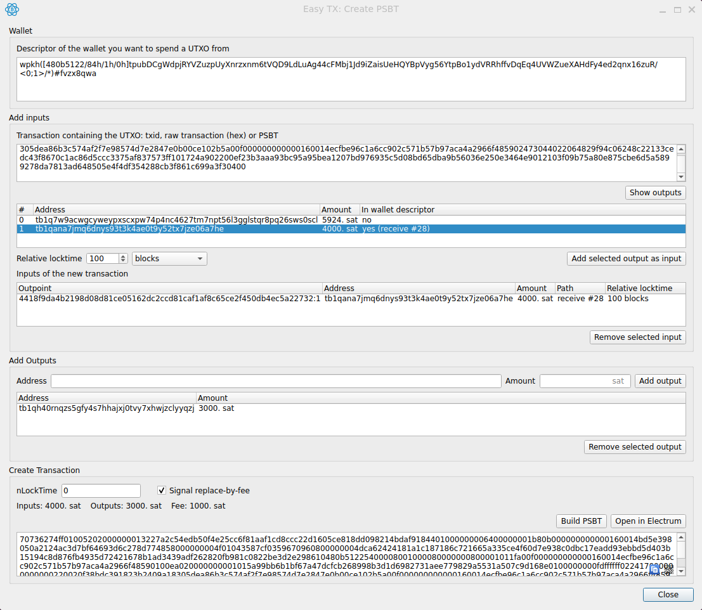
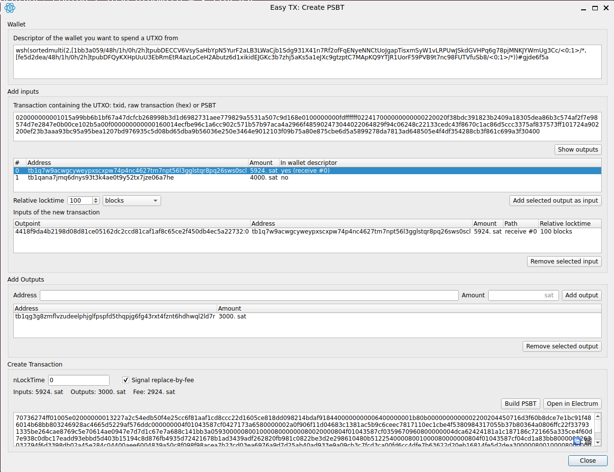

# Easy TX

An Electrum plugin to create PSBTs. The inputs for the PSBT do not have to be part of the blockchain or mempool.

## Use cases

1. Create a (timelocked) backup transaction from a wallet without needing to send funds there yet.
2. Create a transaction chain, e.g. to force a covenant.

## How to use

1. Activate the plugin in Electrum and open it with **Tools → Easy TX**.
2. Enter the wallet descriptor of the wallet you want to spend a UTXO from. It is prefilled with the descriptor of the currently opened Electrum wallet.
3. **Add inputs:** Specify the txid, raw transaction or PSBT you want to use an output from as input for your transaction.
   - Press **Show outputs** to see which outputs correspond to the wallet descriptor.
   - Press **Add selected output as input** to add the input to your transaction.
   - Optionally, you can set a relative timelock.
   - If a txid is entered, the full transaction is fetched from the [mempool.space](https://mempool.space) API.
4. **Add outputs:** Enter an address and amount, then press **Add output**.
5. **Create transaction:** Press **Build PSBT**.

## Screenshots

Spending an output of a single-sig (`wpkh`) wallet with a relative timelock of 100 blocks:

Spending an output of a 2-of-2 multisig (`wsh(sortedmulti(...))`) wallet with a relative timelock of 100 blocks:

